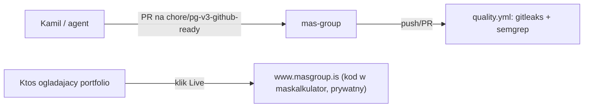

# ARCHITECTURE — mas-group

## Co to jest (3 zdania)

To repo NIE zawiera aplikacji — to publiczna wizytówka/referencja dla platformy B2B MAS Group
(kalkulacja cen, zamówienia, prowizje, logistyka dla pionów auto-części/druk/logistyka), której
kod jest prywatny. Płaci/korzysta MAS Group; repo istnieje, żeby portfolio/audyt mogły wskazać
na coś konkretnego bez ujawniania cen, marż czy danych klientów.

## Stack tego repo (nie produktu)

Zero zależności. Same pliki Markdown + workflow GitHub Actions — jak w `README.md`.

## Co wiadomo o żywym produkcie (publicznie, bez zaglądania w kod)

Z README (zweryfikowane `curl https://www.masgroup.is` -> 200, treść strony zawiera "MAS
Group"): platforma B2B — kalkulatory cen per linia produktowa, pipeline oferta-do-zamówienia
(13 etapów), zarządzanie prowizjami, dostęp wg roli (klient/handlowiec/admin), workflow
logistyczny z SMS (Twilio) i mailem. Stack deklarowany w README: React, TypeScript, Supabase,
Vercel, Google Apps Script, Twilio, n8n — **ten agent nie miał dostępu do kodu w
[`maskalkulator`](https://github.com/kamiljan11/maskalkulator), więc powyższe to informacja z
README produktu, nie zweryfikowany fakt z kodu**. Szczegóły implementacji (schemat danych,
RLS, logika prowizji) [NIEPEWNE — nie widoczne z tego repo].

**Uwaga o domenie:** `https://masgroup.is` (bez `www`) nie ma nasłuchu HTTPS (connection
timeout, zweryfikowane `curl -v`) — `http://masgroup.is` robi redirect 301 na
`http://www.masgroup.is`, który dopiero serwuje 200 po HTTPS. README linkuje wersję z `www`.
Jeśli ktoś wklei gołe `masgroup.is` do przeglądarki z wymuszonym HTTPS, dostanie błąd połączenia
— warto to naprawić po stronie hostingu (certyfikat/redirect na apeksie), ale to zmiana
infrastruktury produktu, poza zakresem tego repo.

## Przepływ (to repo, nie produkt)

## Gdzie jest…

- **kod aplikacji**: nie w tym repo — w `maskalkulator` (patrz README), poza zasięgiem tego audytu
- **dowod, ze produkt zyje**: `docs/RUNBOOK.md` (`curl -I https://www.masgroup.is`)
- **decyzja o rozdziale repo publiczne / kod prywatny**: `docs/adr/0001-public-repo-is-a-reference-not-the-source.md`

## Decyzje nieodwracalne

Lista ADR: `docs/adr/`.

## Jak to cofnąć / kill switch

Nie dotyczy — ten repo nie steruje niczym w produkcji, to wyłącznie dokumentacja.
